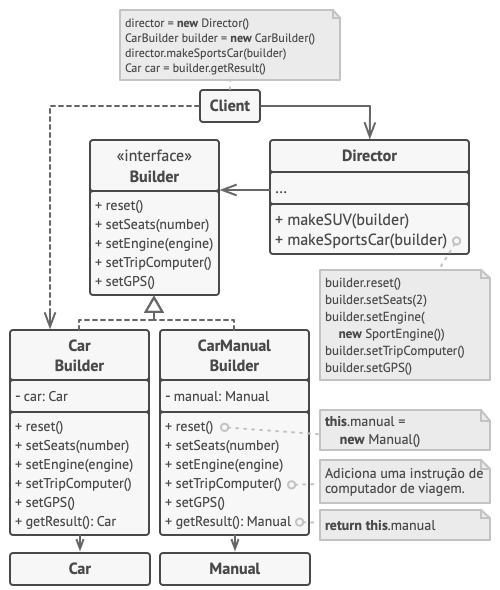

# Builder Como implementar
Certifique-se que você pode definir claramente as etapas comuns de construção para construir todas as representações do produto disponíveis. Do contrário, você não será capaz de implementar o padrão.

Declare essas etapas na interface builder base.

Crie uma classe builder concreta para cada representação do produto e implemente suas etapas de construção.

Não se esqueça de implementar um método para recuperar os resultados da construção. O motivo pelo qual esse método não pode ser declarado dentro da interface do builder é porque vários builders podem construir produtos que não tem uma interface comum. Portanto, você não sabe qual será o tipo de retorno para tal método. Contudo, se você está lidando com produtos de uma única hierarquia, o método de obtenção pode ser adicionado com segurança para a interface base.

Pense em criar uma classe diretor. Ela pode encapsular várias maneiras de construir um produto usando o mesmo objeto builder.

O código cliente cria tanto os objetos do builder como do diretor. Antes da construção começar, o cliente deve passar um objeto builder para o diretor. Geralmente o cliente faz isso apenas uma vez, através de parâmetros do construtor do diretor. O diretor usa o objeto builder em todas as construções futuras. Existe uma alternativa onde o builder é passado diretamente ao método de construção do diretor.

O resultado da construção pode ser obtido diretamente do diretor apenas se todos os produtos seguirem a mesma interface. Do contrário o cliente deve obter o resultado do builder.

