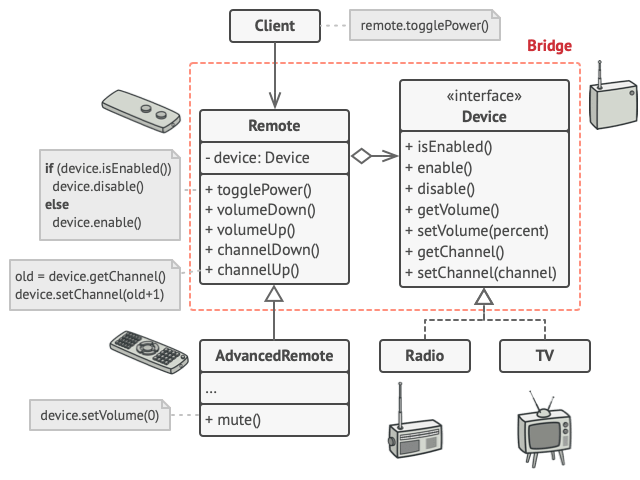

Bridge, Como implementar:

Identifique as dimensões ortogonais em suas classes. Esses conceitos independentes podem ser: abstração/plataforma, domínio/infraestrutura, front-end/back-end, ou interface/implementação.

Veja quais operações o cliente precisa e defina-as na classe abstração base.

Determine as operações disponíveis em todas as plataformas. Declare aquelas que a abstração precisa na interface geral de implementação.

Crie classes concretas de implementação para todas as plataformas de seu domínio, mas certifique-se que todas elas sigam a interface de implementação.

Dentro da classe de abstração, adicione um campo de referência para o tipo de implementação. A abstração delega a maior parte do trabalho para o objeto de implementação que foi referenciado neste campo.

Se você tem diversas variantes de lógica de alto nível, crie abstrações refinadas para cada variante estendendo a classe de abstração básica.

O código cliente deve passar um objeto de implementação para o construtor da abstração para associar um com o outro. Após isso, o cliente pode esquecer sobre a implementação e trabalhar apenas com o objeto de abstração.

[link](https://refactoring.guru/pt-br/design-patterns/bridge)

